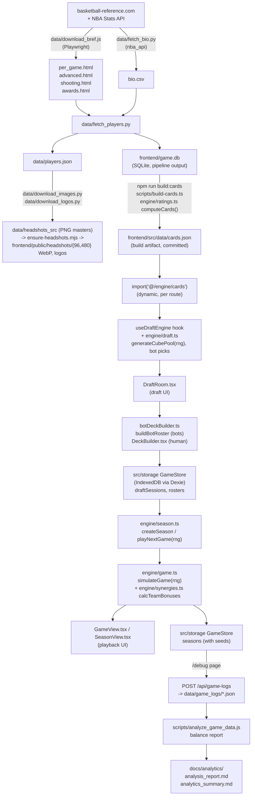

# Architecture

How data flows from basketball-reference to a played game, and which file owns each step.

## 1. Data collection (`data/`)

- **`download_bref.js`** — Playwright scrape of basketball-reference; writes raw HTML
  snapshots (`per_game.html`, `advanced.html`, `shooting.html`, `awards.html`).
- **`fetch_bio.py`** — pulls height/weight/position via `nba_api`; writes `bio.csv`.
- **`fetch_players.py`** — the merge step. Parses the HTML snapshots with BeautifulSoup,
  joins with `bio.csv`, computes the raw per-player stat rows, and writes both
  `frontend/game.db` (tables `Player`, `SeasonStat`, `Award`) and `players.json`. Filters
  to players with >=20 games and >=5.0 MPG.
- **`download_images.py`** / **`download_logos.py`** — pull 1040x760 headshot PNGs into
  `data/headshots_src/` (masters, never deployed) and team logos into `frontend/public/logos`.
  `frontend/scripts/ensure-headshots.mjs` turns the masters into the 96 px and 480 px WebP sets
  the app serves.

Full script contracts (reads/writes/working directory) are in `data/README.md`.

## 2. Card computation (`frontend/src/engine/ratings.ts`, run at build time)

`computeCards(input)` is the only place ratings are computed. It is pure: it takes the
`Player`, `SeasonStat` and `Award` rows as plain arrays and returns cards. It runs in
`scripts/build-cards.ts` (`npm run build:cards`), which reads `game.db` and writes
`frontend/src/data/cards.json`; the app only ever reads that JSON (`engine/cards.ts`). Steps:

1. Takes the latest `SeasonStat` row per player.
2. Buckets each player into a positional pool (`PG`/`SG`/`SF`/`PF`/`C`/`G`/`F`/`G-F`/`F-C`/
   `Gold`) via `getPool()`.
3. Computes seven skill ratings per player (finishing, mid-range, perimeter, playmaking,
   rebounding, perimeter defense, post defense) by indexing each raw stat against a
   benchmark — the mean of the top 7.5% of rotation players in that stat (`RATING_CONFIG
   .benchmarkCutoff`). The `idx()` function maps league mean → 0.5 and elite → 1.0.
4. Overall rating in two passes (card_ratings_rebalance): pass 1 averages each player's
   seven UNCAPPED dimension raws into one composite (`rawOvrMean`); pass 2 re-indexes that
   composite through the same `idx()` every dimension uses, so the rotation average lands
   near 50 OVR and the rotation top 7.5% at 99. No positional weights and no PER/VORP
   multiplier. OVR is never a game input and never shown to users.
5. Assigns rarity from the overall rating, then bumps it for MVP/All-NBA/DPOY/All-Defense,
   for a hardcoded `LEGENDARY_PLAYERS` list, and for league-leader status (top scorer,
   rebounder, assister, stealer, blocker, or 3pt-maker).
6. Assigns badges (`getBadge`, thresholds from `BADGE_THRESHOLDS` in `balance.ts`) and situational traits (Ironman,
   Sniper, Volume Scorer, etc.) from raw stats.

Delivered as a JavaScript chunk through `import('@/engine/cards')` at the point of use (draft
room, `/data`, `/deckbuilder-test`), never from the root layout; the home page imports only
`src/data/showcase.json` (Mythic + Rare). `CARD_SET_VERSION` lives in the data-free
`engine/cardSetVersion.ts` so storage can read it without the card set. All tuning constants for this
step (`RATING_CONFIG`, legendary list, badge/rarity thresholds) live in
`engine/balance.ts`.

## 3. Draft (`engine/draft.ts` + `useDraftEngine.ts` + `DraftRoom.tsx`)

- **`generateCubePool(players, plays, rng)`** builds all 24 packs (8 seats x 3 rounds) upfront
  from a seeded `Rng` (the seed is minted in `useDraftEngine` and stored on the
  `DraftSession`): shuffles the
  full player pool, takes 264 player cards (11 per pack) with each player used at most
  once per pass, cycling with a suffixed id only if the pool has fewer than 264 players
  (it currently has 448, from `game.db`, so this should not trigger). Adds one random play
  card per pack.
- **`useDraftEngine`** is the draft state machine: seats 8 players (1 human + 7 bots named
  from `BOT_NAMES`), deals packs, and on each pick rotates packs left/right (standard
  booster-draft snake direction, reversed for the middle pack) via `processPickAndPass`.
  It also records every pick (`DraftPickRecord`) into a `pickLog` for later analysis.
- **`getBotPick` / `scoreCardForBot`** (`engine/draft.ts`) score each card in a bot's pack:
  value from `ratings.overall` times a rarity multiplier (a rarity base for plays, see
  `rawBaseValue`), a seeded per-bot noise multiplier, a bomb-pull bonus for a pack's clear
  best card, a positional-need multiplier and a pull toward the bot's target identity
  (`planPull`) that both ramp with the plan weight as the draft goes on, and for play cards
  a staffability blend scaled by the bot's synergy awareness.

## 4. Deck building (`engine/deckbuilder.ts` + `DeckBuilder.tsx`)

- **`buildBotRoster`** auto-builds each bot's 12-man active roster: best player per
  position first, then fills to 12 by positional need, then by smallest column; picks the
  top 3 play cards by category (system > special > basic) then rarity; everyone else stays
  in `BuiltRoster.rosterPlayers`/`rosterPlays` (the bench pool).
- The human's roster starts with an empty depth chart and every drafted card in the
  "Roster" sidebar list (no auto-fill — the human builds the lineup) and is built
  interactively in **`DeckBuilder.tsx`** (depth chart ordering, active play selection),
  then saved through the `GameStore` (`saveRoster`); the whole 8-seat draft is saved as a
  `DraftSession` (`saveDraftSession`) when the draft ends. See section 8 for the storage
  layer.

## 5. Game engine (`engine/game.ts` and the modules split out of it)

`simulateGame(homeTeam, awayTeam, { rng })` produces a full `GameTheater` object (which
records its `seed`) that the UI plays back possession-by-possession (no live simulation
loop in the UI). Every random draw goes through the `Rng`, so the same seed and rosters
reproduce the same game. `game.ts` keeps `simulateGame` and re-exports the public API; the
rest was split into single-purpose modules (render_and_engine_perf D6): `gameTypes.ts`
(types), `rotation.ts`, `shot.ts`, `possession.ts`, `boxscore.ts`, `teamInfo.ts`.

Once per game:

1. **Possession shares** (`rotation.ts` `calcPossessionShares`) — each player's share of
   his position's possessions, from the OVR gap between starter, backup and deep bench
   blended with real MPG. `prepareLineupDraw` turns them into per-position weights once.
2. **Playbook and identity** — `playbook.ts` `evaluatePlaybook` decides which assigned
   plays are active and their call allocation; `synergies.ts` `calcTeamBonuses` turns the
   chosen archetypes into offense/defense `GameModifiers`. Plays are NOT part of those
   bonuses: they are rolled per possession.
3. **Possession count** (`shot.ts` `calcPossessionSplit`) — both teams start at
   `BASE_PACE` plus independent pace noise (home skewed slightly positive: that is the
   home-court mechanic), plus identity/play possession swing, clamped to a pace band.
   There is NO pre-game "possession battle" any more (engine_possession_model D6): what a
   roster's playmaking, rebounding and defence are worth is settled per possession, below.

Per possession (`possession.ts` `playOnePossession`), from the five on the floor:

4. **Lineup** — `drawPreparedLineup` draws one player per position by share; inside the
   crunch-time window and in overtime the starters close. A called play can force its
   assigned players on (`overrideLineupForPlay`).
5. **Turnover roll** (`turnoverChance`) — lineup playmaking against perimeter defence; the
   possession may end here.
6. **Shot profile** — `calcLineupShotProfile` blends the NBA baseline (`PROFILE_WEIGHT`
   0.50) with the plain mean of the lineup's finishing / mid-range / perimeter ratings,
   plus identity share mods; a called play shifts it (`applyCalledShareShift`); the
   creator steer (`steerShotProfile`) moves up to `STEER_CAP` of share toward the shot
   worth the most against THIS defence.
7. **Resolution** (`resolvePossession`) — roll the channel, compute `channelEdge`
   (aggregated lineup offence vs the matched defence, centred on `LINEUP_CENTRE`), shift
   the channel's base efficiency by `edge x EFFICIENCY_SCALE` (0.20) clamped to
   `MAX_EFF_SHIFT` (0.08), roll make/miss, then points and an and-1 check.
8. **Offensive rebound** (`offensiveReboundChance`) — a missed field goal may be kept
   alive, rebounding against rebounding, up to `OREB_MAX_CHAIN` (2) times.

Five players become one number per dimension in `lineup.ts` (`lineupValue`: standardise,
self-weighted mean, hole tax). Those aggregates are memoized per game for the lineup arrays
the simulation interns (`memoLineup`), which is bit-identical and about a third faster.
`boxscore.ts` derives the box score (`boxScoreThrough` replays it to any possession for the
live view; `accumulateBoxRow` is the one place rows are summed).

**Tuning knobs** all live in `engine/balance.ts` (`NBA_BASELINE`, `EFFICIENCY_SCALE`,
`MAX_EFF_SHIFT`, `LINEUP_AGG`, `LINEUP_CENTRE`, `STEER_*`, `TURNOVER_*`, `OREB_*`,
`AND1_BASE`, the pace noise bounds, `CLUTCH_WINDOW_POSS`); identity data lives in
`engine/archetypes.ts`, play roles in `engine/playbook.ts`.
Convention: `TeamBonuses.defenseMods` are deltas added to the *opponent's* offense, so a
defensive effect is stored negative.

## 6. Season (`engine/season.ts` + `SeasonView.tsx`)

`createSeason(session, rosterId, rng)` builds a 7-game schedule (one game against each of
the other 7 seats, home/away alternating) and standings, and stores a season `seed`;
`playNextGame` derives a per-game seed, simulates via `engine/game.ts`, stores the seed on
the schedule entry and updates standings (wins desc, then point differential). Persisted
through the `GameStore` (`saveSeason`), keyed by `rosterId` + the originating `sessionId`.

## 6b. 82:0 Challenge (`engine/challenge.ts` + `app/challenge/[rosterId]/`)

The second game mode. A `DraftSession` carries `gameMode: 'tournament' | 'challenge'`
(missing = tournament) stamped at draft time from `/draft?...&game=`, and both the deck
builder's save CTA and the `/rosters` CTA route by it, so a roster can only enter the mode
it was drafted for.

`engine/challenge.ts` is pure and owns everything deterministic: `buildNbaTeams` (30
opponents from the card pool via `buildBotRoster`, with an empty-depth-chart-column fix),
`buildChallengeSchedule` (30 shuffled, repeated 3x, first 82), `challengeGameSeed` and
`mixSeed` (every game, the schedule and the trade pack derive their OWN stream from the run
seed, so reveal speed, a skip or a reload can never shift a result), `CHALLENGE_GRADES` /
`gradeForWins`, `simulateHalf` (41 games in one call, returning a W/L string, per-game
scores and top performers, player totals and opponent team totals) and `drawTradeOffers`.
`engine/challengeAdvice.ts` sits on top: pace band, ranked reasons and three speaker quotes
rendered from the pools in `src/narration/challenge/`.

`app/challenge/[rosterId]/page.tsx` is only a PHASE MACHINE — `first -> break -> second ->
done` — and holds the one invariant that matters: a half is simulated and committed to the
store before any component animates it, and nothing is ever simulated for a half already in
`run.halves`. That is what makes a reload replay the reveal instead of re-rolling the
season. When the roster changed at the break it also replays half 2 against `rosterPre` and
stores it as `run.ghost`, the results screen's counterfactual. Components under
`components/challenge/` (`FlipClock`, `TierLadder`, `ChallengeReel`, `FrontOffice`, `Trade`,
`Results`) are presentation over that committed data and hold no simulation of their own.

Challenge routes are dark by `data-theme="night"` on the subtree rather than hand-picked
inverse tokens, and are game routes (`lib/routes.ts`), so TopNav shows its gear menu and the
challenge headers reserve `--spacing-nav-gear` to clear it. `/challenge/preview` and
`/challenge/preview-results` render the signed boards from fixtures with no auth, storage or
simulation — the design-sign-off routes.

Storage is a `ChallengeRun` per roster (see §8), and `frontend/scripts/challenge-sim.ts`
(`npm run challenge`) is the headless calibrator for `CHALLENGE_TUNING`.

## 6c. Playoffs (PvP) (`engine/playoffs.ts` + `lib/matchAdvance.ts`/`matchSimulate.ts` + `app/api/match/[id]/advance/` + `app/playoffs/`)

A "Playoffs" match is a two-human best-of-seven, drafted live from the same cube
(`pvp_draft`) and then played out as a server-simulated series (`pvp_series`). Unlike
every other mode, the record of TRUTH is one `public.matches` row, not each client's own
store: `Match` (`storage/matchTypes.ts`) mirrors the row column for column, and every
client mutation goes through a versioned, security-definer RPC (`match_invite`,
`match_respond`, `match_pick`, `match_lock_roster`, `match_sideboard`, `match_seen`,
`match_heartbeat`, `match_expire`, `match_void`) — never a direct table write. Both
participants can read both sides of the row under RLS; hiding the opponent's bench, plays
and identity before/during a game is a UI-only gate (`GameView`'s `hideOpponentDetails`),
not a data-access restriction — the server never has less to send one side than the other.

Once both rosters are locked, `POST /api/match/[id]/advance` is the ONLY writer of a
series' progress. It is thin glue: load the row with the service role (after running
`match_expire` through the CALLER's own client first, so a stale/idle match can't be
advanced into), loop `planAdvance` (`lib/matchAdvance.ts`) at most 8 times applying each
step under version CAS, and re-plan from a reload on a lost race — so two overlapping
calls (a client visit and the opponent's) never double-simulate a game. `planAdvance` is
pure and unit-tested without Next or Supabase: over -> `done`; the first side to reach 2
wins with no sideboard yet -> `sideboard`; no games yet -> simulate game 1; both sides have
seen the last game (or one has, 24h ago) -> simulate the next one; otherwise wait. The
actual game is `lib/matchSimulate.ts`'s `simulateMatchGame` — `engine/playoffs.ts`'s
`coinFlip`/`homeFor`/`gameSeed` (pure functions of the match seed, so a viewer replays
exactly what the server simulated from just the stored seed and rosters, no separate
play-by-play log needed) feeding `buildTeamInfo` + `simulateGame` with TOURNAMENT balance,
never `CHALLENGE_TUNING`. Which roster plays is `rostersForNextGame`: the locked roster
until both sideboard entries exist, the sideboarded snapshot after.

The route is called from two places, both idempotent and safe to re-fire: the series page
(`app/playoffs/[id]/page.tsx`) on load and whenever the row's version changes (debounced
300ms — the timer, not the scheduling, is what stamps the per-version dedupe ref, so a
StrictMode dev double-effect doesn't permanently skip a version), and the game page
(`app/playoffs/[id]/game/[n]/page.tsx`) once a viewer's playback reaches the end (which
also sends `match_seen`). No polling loop drives the series forward on its own — Realtime
(`useMatch`, same channel/heartbeat/offline-detection machinery as `pvp_draft`) carries the
result back to both clients once the route has written it.

## 7. Logging and analysis

The `/debug` page calls `GameStore.exportAll()` and `POST`s the result to `/api/game-logs`
(`frontend/src/app/api/game-logs/route.ts`), which writes one JSON file per draft session
and per season plus a combined `full_dump_*.json` into `data/game_logs/` (resolved as
`../data/game_logs` relative to `process.cwd()` — again assumes cwd is `frontend/`). That
directory is gitignored; regenerate it by playing the app rather than committing exports.

`scripts/analyze_game_data.js` (`npm run analyze`) reads the newest `full_dump_*.json` and
prints draft-cube integrity, rarity distribution, OVR-vs-outcome correlation, synergy/play
activation rates, and score-range sanity checks. The curated writeups in
`docs/analytics/analysis_report.md` (raw per-session breakdown) and
`docs/analytics/analytics_summary.md` (findings + the user's own architectural hypotheses,
quoted as "User Note") are hand-curated snapshots of that script's output, not
regenerated automatically.

## 8. Persistence (`frontend/src/storage/`)

UI code never touches `localStorage` or IndexedDB directly. It calls `getGameStore()`,
which returns the single `GameStore` implementation for the environment:

- `indexedDb.ts` — Dexie database `MagicBallDB` with tables `draftSessions`, `rosters`,
  `seasons`, `challengeRuns`, `outbox`, `meta`. Quota failures surface as `StorageQuotaError`, which
  the deck builder and season view show inline.
- `memory.ts` — in-memory store used during SSR and in tests.
- `migrate.ts` — one-time import of the pre-Phase-1 `localStorage` keys
  (`hoops-draft-sessions`, `hoops-draft-seasons`, `myRosters`); the old keys are renamed
  to `*.migrated`, never deleted.
- `StorageProvider` (`src/components/StorageProvider.tsx`) runs `initStorage()` once at
  app start and exposes `useStorageReady()` so pages can wait for the migration.
- `StorageProvider` also keeps the store's OWNER in step with `AuthProvider`'s profile
  (sync_outbox): login, logout and an account switch are soft navigations, so the owner
  is re-applied on every change, one change after another. Both local stores ALWAYS filter
  reads by owner (no owner = only never-claimed rows). Ownerless rows are claimed once per
  device (`legacy_claimed` meta flag). `useStorageReady()` is false while a change applies.
- `supabase.ts` — `SupabaseGameStore`, the browser default in `getGameStore()`. It wraps a
  local store (`GameStore & OutboxStore`); every read goes through it. **Local-first with
  an outbox** (sync_outbox, migration `202609210001_sync_outbox.sql`):
  - A save or delete resolves on the LOCAL write and leaves one payload-free `OutboxRecord`
    per `${ownerId}:${table}:${id}` (Dexie table `outbox`, schema v5). Ten offline saves of
    one roster are one record; a delete replaces a pending upsert.
  - A single-flight **drain** pushes one key at a time, re-reading the current local row at
    send time. Triggers: a write, `online`, the tab becoming visible, the end of
    `setOwnerId`, the backoff timer. Pull and drain share one promise chain, and every
    request has a timeout (supabase-js has none).
  - A push is the `cas_upsert` RPC: compare-and-swap against the **baseline** (the
    `updated_at` the server held when both sides last agreed), persisted per owner in
    `meta` (`sync.baselines:<ownerId>`). Any rejection that carries a row is merged by the
    pure `merge.ts` (same purity discipline as `engine/`): draft sessions keep the longer
    `pickLog`, seasons union played games and recompute standings, rosters keep the newest
    edit, a `ChallengeRun` keeps the later `phase` (a tie goes to the run created first, so
    two devices converge). Only a truly diverged draft is parked for `SyncConflictPrompt`.
  - A delete is a `cas_delete` **tombstone** (`deleted_at`). A pull applies tombstones
    locally, which is how a second device learns a row is gone; a newer local save still
    in the outbox beats a tombstone, and an insert revives one.
  - The **pull** is two-phase: `id, updated_at, deleted_at` first, then `data` only for
    rows whose stamp differs from the baseline. It runs at sign-in (readiness waits at most
    6 s for it) and when the app is resumed after 5+ minutes.
  - Transient errors back off (2 s doubling, 60 s cap). Permanent ones (RLS, payload cap
    16 MiB, unknown table) park the record as `blocked` (`SyncStatus.blocked`); it gets one
    fresh attempt per sign-in.
  - `getOrCreateSeason` / `getOrCreateChallengeRun` create at most one row per roster, in
    one Dexie `rw` transaction, under `season_<rosterId>` / `challenge_<rosterId>`.
  - Server side: primary key `(owner_id, id)`, writes only for an APPROVED profile, the
    table allowlist lives in one `sync_table_allowed()` function. `/api/analytics` and
    `/admin/analytics` read the same tables (`src/lib/analyzeStats.ts`, shared with
    `scripts/analyze.ts`) — `scope=self` under the caller's RLS session, `scope=all`
    ADMIN-gated; both skip tombstones.

## 9. Headless tooling

- `npm test` — Vitest: `tests/unit` imports the real engine (ratings, draft, synergies
  and plays, game sim, season, determinism, engine purity) and `tests/storage` runs the
  store contract against both backends using `fake-indexeddb`.
- `npm run balance -- 1000 --seed 42` — `scripts/balance.ts` runs a full
  draft, roster and season pipeline for N games in a few seconds and prints PPP, score
  distribution and synergy/play activation rates. This is the tuning loop.
- `npm run build:cards` — regenerates `src/data/cards.json` from `game.db`.
