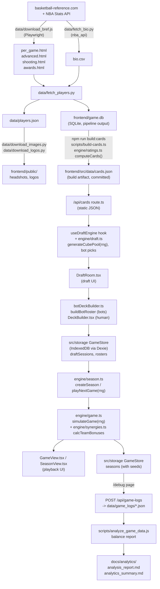

# Architecture

How data flows from basketball-reference to a played game, and which file owns each step.

## 1. Data collection (`data/`)

- **`download_bref.js`** — Playwright scrape of basketball-reference; writes raw HTML
  snapshots (`per_game.html`, `advanced.html`, `shooting.html`, `awards.html`).
- **`fetch_bio.py`** — pulls height/weight/position via `nba_api`; writes `bio.csv`.
- **`fetch_players.py`** — the merge step. Parses the HTML snapshots with BeautifulSoup,
  joins with `bio.csv`, computes the raw per-player stat rows, and writes both
  `frontend/game.db` (tables `Player`, `SeasonStat`, `Award`) and `players.json`. Filters
  to players with >=20 games and >=5.0 MPG.
- **`download_images.py`** / **`download_logos.py`** — pull headshots and team logos into
  `frontend/public/{headshots,logos}`.

Full script contracts (reads/writes/working directory) are in `data/README.md`.

## 2. Card computation (`frontend/src/engine/ratings.ts`, run at build time)

`computeCards(input)` is the only place ratings are computed. It is pure: it takes the
`Player`, `SeasonStat` and `Award` rows as plain arrays and returns cards. It runs in
`scripts/build-cards.ts` (`npm run build:cards`), which reads `game.db` and writes
`frontend/src/data/cards.json`; the app only ever reads that JSON (`engine/cards.ts`,
`/api/cards`). Steps:

1. Takes the latest `SeasonStat` row per player.
2. Buckets each player into a positional pool (`PG`/`SG`/`SF`/`PF`/`C`/`G`/`F`/`G-F`/`F-C`/
   `Gold`) via `getPool()`.
3. Computes seven skill ratings per player (finishing, mid-range, perimeter, playmaking,
   rebounding, perimeter defense, post defense) by indexing each raw stat against a
   benchmark — the mean of the top 7.5% of players in that stat (`RATING_CONFIG
   .benchmarkCutoff`).
4. Combines the seven ratings into an overall rating using a positional weight profile
   (`RATING_CONFIG.ovr.PROFILES`), a top-2-stat boost (`TOP1`/`TOP2`), an off-role
   forgiveness term (`FORGIVE`/`OFFROLE_MAX_W`/`REF`), a **core-gap penalty** that punishes
   weakness in a position's top-3 weighted stats (`CORE_PEN`/`CORE_REF`), and a composite
   PER/VORP/DBPM multiplier (0.80–1.15x).
5. Assigns rarity from the overall rating, then bumps it for MVP/All-NBA/DPOY/All-Defense,
   for a hardcoded `LEGENDARY_PLAYERS` list, and for league-leader status (top scorer,
   rebounder, assister, stealer, blocker, or 3pt-maker).
6. Assigns badges (`getBadge`, thresholds 80/90/96) and situational traits (Ironman,
   Sniper, Volume Scorer, etc.) from raw stats.

Served to the client via `frontend/src/app/api/cards/route.ts` (`GET /api/cards`), which
returns the committed JSON with a one-hour cache header. All tuning constants for this
step (`RATING_CONFIG`, legendary list, badge/rarity thresholds) live in
`engine/balance.ts`.

## 3. Draft (`engine/draft.ts` + `useDraftEngine.ts` + `DraftRoom.tsx`)

- **`generateCubePool(players, plays, rng)`** builds all 24 packs (8 seats x 3 rounds) upfront
  from a seeded `Rng` (the seed is minted in `useDraftEngine` and stored on the
  `DraftSession`): shuffles the
  full player pool, takes 264 player cards (11 per pack) with each player used at most
  once per pass, cycling with a suffixed id only if the pool has fewer than 264 players
  (it currently has 448, from `game.db`, so this should not trigger). Adds one random play
  card per pack.
- **`useDraftEngine`** is the draft state machine: seats 8 players (1 human + 7 bots named
  from `BOT_NAMES`), deals packs, and on each pick rotates packs left/right (standard
  booster-draft snake direction, reversed for the middle pack) via `processPickAndPass`.
  It also records every pick (`DraftPickRecord`) into a `pickLog` for later analysis.
- **`getBotPick` / `scoreCardForBot`** (`engine/draft.ts`) score each card in a bot's pack:
  PER-based base value (or a rarity table for play cards), a seeded pseudo-random 15%
  noise multiplier per bot, a positional-need pivot after pick 10, a synergy/trait-overlap
  bonus after pick 5, a favored-trait bonus, and a hate-draft floor for high-PER players.

## 4. Deck building (`engine/deckbuilder.ts` + `DeckBuilder.tsx`)

- **`buildBotRoster`** auto-builds each bot's 12-man active roster: best player per
  position first, then fills to 12 by positional need, then by smallest column; picks the
  top 3 play cards by category (system > special > basic) then rarity; everyone else goes
  to the G-League bench.
- The human's roster is built interactively in **`DeckBuilder.tsx`** (depth chart
  ordering, active play selection) and saved through the `GameStore` (`saveRoster`); the
  whole 8-seat draft is saved as a `DraftSession` (`saveDraftSession`) when the draft
  ends. See section 8 for the storage layer.

## 5. Game engine (`engine/game.ts` + `engine/synergies.ts`)

`simulateGame(homeTeam, awayTeam, { rng })` produces a full `GameTheater` object (which
records its `seed`) that the UI plays back possession-by-possession (no live simulation
loop in the UI). Every random draw goes through the `Rng`, so the same seed and rosters
reproduce the same game:

1. **Possession shares** (`calcPossessionShares`) — per-player share of team possessions,
   derived from OVR gap between starter/backup/deep bench and blended with real MPG.
2. **Bonuses** (`synergies.ts` `calcTeamBonuses`) — sums badge levels across the 12-man
   roster (`countBadges`), checks each `SYNERGIES` entry (stacking / combo / chemistry
   tiers) and each active `Play`'s requirements (`PLAY_EFFECTS`, full bonus if all
   requirements met, half if >=50%), and nets them into offense/defense `GameModifiers`
   (shot-share shifts, efficiency shifts, possession swing, and-1 chance).
3. **Possession battle** (`calcPossessionSplit` / `calcTeamPossRating`) — starts both
   teams at 100 possessions +/-5% noise, then shifts up to +/-8% based on a
   playmaking(40%)/rebounding(35%)/defense(25%) rating (starters weighted 2x), plus
   synergy/play possession swings.
4. **Shot profile** (`calcTeamShotProfile`) — blends 50% NBA baseline shot distribution
   (35% rim / 25% mid / 40% three) with 50% team tendency from finishing/mid-range/
   perimeter ratings, then applies share-bonus modifiers.
5. **Per-possession resolution** (`resolvePossession`) — rolls a shot channel from the
   profile, computes an edge (offense rating vs. matched defense rating, clamped
   +/-0.25), shifts the channel's baseline efficiency by `edge * 0.30` (clamped +/-10pp,
   `EFFICIENCY_SCALE` / `MAX_EFF_SHIFT` constants), rolls make/miss, then points (rim
   averages 1.5 via a 50/50 2-vs-1-point split modeling free throws) and an and-1 check
   (`AND1_BASE`, per channel).
6. Rotation timelines (`generateQuarterRotation`) drive substitutions and which 5-man
   lineup is on court for each possession; overtime uses starters only.

**Tuning knobs** all live in `engine/balance.ts`: `NBA_BASELINE` (shot shares/efficiency),
`LEAGUE_AVG` (edge centring), `EFFICIENCY_SCALE`, `MAX_EFF_SHIFT`, `PROFILE_WEIGHT`,
`AND1_BASE`, `STRENGTH_SWING_PCT`, `NOISE_PCT`, `TURNOVER_RATE`, possession clamps;
synergy/play tables live in `engine/synergies.ts` (`SYNERGIES`, `PLAY_EFFECTS`).
Convention: `TeamBonuses.defenseMods` are deltas added to the *opponent's* offense, so a
defensive effect is stored negative.

## 6. Season (`engine/season.ts` + `SeasonView.tsx`)

`createSeason(session, rosterId, rng)` builds a 7-game schedule (one game against each of
the other 7 seats, home/away alternating) and standings, and stores a season `seed`;
`playNextGame` derives a per-game seed, simulates via `engine/game.ts`, stores the seed on
the schedule entry and updates standings (wins desc, then point differential). Persisted
through the `GameStore` (`saveSeason`), keyed by `rosterId` + the originating `sessionId`.

## 7. Logging and analysis

The `/debug` page calls `GameStore.exportAll()` and `POST`s the result to `/api/game-logs`
(`frontend/src/app/api/game-logs/route.ts`), which writes one JSON file per draft session
and per season plus a combined `full_dump_*.json` into `data/game_logs/` (resolved as
`../data/game_logs` relative to `process.cwd()` — again assumes cwd is `frontend/`). That
directory is gitignored; regenerate it by playing the app rather than committing exports.

`scripts/analyze_game_data.js` (`npm run analyze`) reads the newest `full_dump_*.json` and
prints draft-cube integrity, rarity distribution, OVR-vs-outcome correlation, synergy/play
activation rates, and score-range sanity checks. The curated writeups in
`docs/analytics/analysis_report.md` (raw per-session breakdown) and
`docs/analytics/analytics_summary.md` (findings + the user's own architectural hypotheses,
quoted as "User Note") are hand-curated snapshots of that script's output, not
regenerated automatically.

## 8. Persistence (`frontend/src/storage/`)

UI code never touches `localStorage` or IndexedDB directly. It calls `getGameStore()`,
which returns the single `GameStore` implementation for the environment:

- `indexedDb.ts` — Dexie database `MagicBallDB` with tables `draftSessions`, `rosters`,
  `seasons`, `meta`. Quota failures surface as `StorageQuotaError`, which the deck
  builder and season view show inline.
- `memory.ts` — in-memory store used during SSR and in tests.
- `migrate.ts` — one-time import of the pre-Phase-1 `localStorage` keys
  (`hoops-draft-sessions`, `hoops-draft-seasons`, `myRosters`); the old keys are renamed
  to `*.migrated`, never deleted.
- `StorageProvider` (`src/components/StorageProvider.tsx`) runs `initStorage()` once at
  app start and exposes `useStorageReady()` so pages can wait for the migration.

A remote backend (Phase 4, accounts and cloud saves) is a third implementation of the
same interface, with the IndexedDB store kept as the offline cache.

## 9. Headless tooling

- `npm test` — Vitest: `tests/unit` imports the real engine (ratings, draft, synergies
  and plays, game sim, season, determinism, engine purity) and `tests/storage` runs the
  store contract against both backends using `fake-indexeddb`.
- `npm run balance -- 1000 --seed 42` — `scripts/balance.ts` runs a full
  draft, roster and season pipeline for N games in a few seconds and prints PPP, score
  distribution and synergy/play activation rates. This is the tuning loop.
- `npm run build:cards` — regenerates `src/data/cards.json` from `game.db`.
